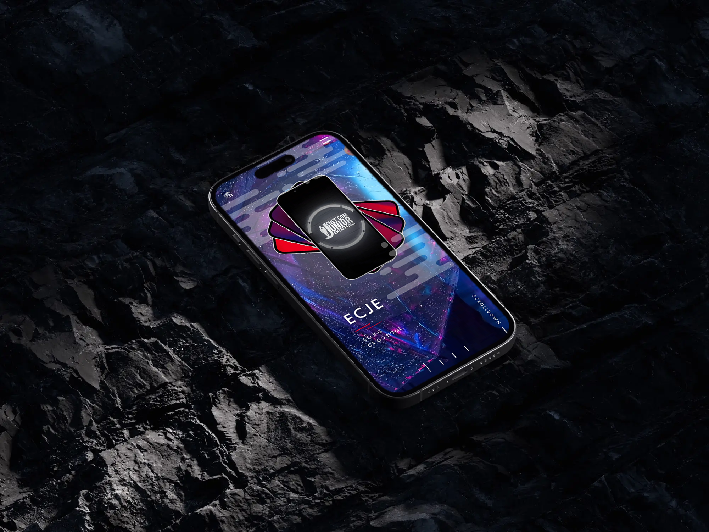

<p align="center">
    
</p>

# ECJE Plus

ECJE Plus is a mobile app that embodies a new level of innovation, designed to redefine your digital experience. Developed using cutting-edge technologies, this app presents a world of possibilities.

## Preview

<details>
  <summary>Click to expand for more images</summary>

  
  
  
  <div style="text-align:center;">
  <table style="margin: 0 auto;">
    <tr>
      <td> 
      </td>
      <td>
      </td>
    </tr>
     <tr>
      <td> 
      </td>
      <td>
      </td>
    </tr>
  </table>
 <h2>Order Page</h2>
  <table style="margin: 0 auto;">
    <tr>
      <td> 
      </td>
      <td>
      </td>
    </tr>
     <tr>
     <td>
      </td>
      <td> 
      </td> 
    </tr>
  </table>
</div>

</details>

## Live Demo

🌐 Explore the live demo of ECJE Plus: [**Live Demo**](https://example.com) <!-- Replace with the actual live demo URL -->

**Disclaimer:** This repository contains a web-based recreation of the ECJE PLUS App . The actual source code of the ECJE PLUS App  is classified and not included here. This demo serves as a showcase of web technologies and does not represent the full functionality of the real app.


Feel free to interact with the app and experience its features in action.

## Table of Contents

- [Overview](#overview)
- [Tech Stack](#tech-stack)
- [Features](#features)
- [Getting Started](#getting-started)
- [Usage](#usage)
- [Contributing](#contributing)
- [License](#license)

## Overview

The ECJE PLUS App  is a cutting-edge demonstration of my exceptional technological prowess and innovative solutions.This app showcases the limitless potential of ECJE's services.

At the heart of the ECJE PLUS App  lies our AI-Powered Virtual Assistant, a technological marvel that leverages advanced AI technologies, code name EVA. Built on the foundation of GPT-3 API and Eleven Labs API, our virtual assistant engages users in natural conversations, provides insightful answers, and offers a seamless experience that's both intuitive and intelligent.

Powered by state-of-the-art AI, the ECJE PLUS App  is more than just a mobile application; it's an intelligent companion that demonstrates the power of AI in transforming how users interact with technology.

Explore the future of AI with the ECJE PLUS App .

## Tech Stack

### Languages:

- 
- 

### Platforms:

- 
- 

### Backend:
- 


## Features

- **AI-Powered Virtual Assistant:** Experience a cutting-edge AI-powered virtual assistant that leverages the GPT-3 API and Eleven Labs API to engage with users intelligently.

- **Dynamic Background:** With a simple click of a button, users can dynamically change the animated background, allowing them to personalize their experience and set the mood.


- **Push Notifications:** Stay informed and connected with push notifications that provide real-time updates.

- **Innovative Interface:** Enjoy a sleek and intuitive user interface.

- **Cross-Platform Compatibility:** Works seamlessly on both iOS and Android.

- **Swift and Kotlin:** Utilizes Swift and Kotlin for enhanced performance.

- **Firebase Backend:** Powered by Firebase for real-time data and cloud services.

## Getting Started

To get started with ECJE Plus, follow these steps:

1. Clone this repository to your local machine.

   ```bash
   git clone https://github.com/Sami-Souissi/ECJE_Plus_APP
   ```

2. Install the necessary dependencies.

   ```bash
   npm install
   ```

3. Run the app on your preferred platform (iOS or Android).

   ```bash
   npm run ios
   ```
   or
   ```bash
   npm run android
   ```

4. Explore the app and enjoy the experience.


## Contributing

We welcome contributions to enhance ECJE Plus. If you'd like to contribute, please follow these guidelines:

1. Fork the repository.
2. Create a new branch for your feature or fix.
3. Make your changes and commit them.
4. Push your changes to your fork.
5. Submit a pull request to the main repository.

## License

This project is licensed under the [MIT License](LICENSE.md) - see the [LICENSE.md](LICENSE.md) file for details.
